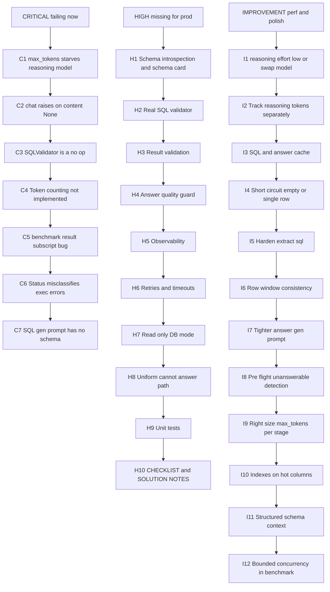

# Pipeline Issues, Prioritized

This is the audit captured while reading the baseline LLM analytics pipeline before any code was changed. It documents the starting state of the repo so the diff in `git log` reads against a known baseline. Tiers are **Critical** (currently failing), **High** (missing for production), and **Improvement** (performance and polish). Items marked `[NEW]` were discovered during live debugging runs (reasoning-model starvation, content-None handling) rather than from a static read.

---

## Overview



> File paths in this document refer to the **starter layout** (`src/llm_client.py`, `src/pipeline.py`, `scripts/benchmark.py`) at the time of the audit. After the fix-and-refactor cycle, the same code lives under `backend/src/services/`, `backend/src/validators/`, and `backend/scripts/`. See `docs/SOLUTION_NOTES.md` for the mapping.

---

## Critical, failing now

| # | Issue | Location | Impact |
|---|---|---|---|
| C1 `[NEW]` | `max_tokens=240` with `gpt-5-nano` reasoning model. 192 reasoning tokens eat the whole budget, `finish_reason="length"`, `content=None`. | `src/llm_client.py:82` (SQL gen), `:132` (answer gen) | **Every LLM call fails.** Pipeline returns `sql=None` on every request. |
| C2 `[NEW]` | `_chat` raises on `content=None` instead of degrading or retrying. | `src/llm_client.py:42-45` | Recoverable length-cutoffs become hard errors; no visibility into finish reason. |
| C3 | `SQLValidator.validate()` is a no-op TODO; always returns `is_valid=True`. | `src/pipeline.py:36-44` | `test_invalid_sql_is_rejected` fails (expects `status="invalid_sql"` plus non-null `sql_validation.error` on "delete all rows"). No DML or DDL blocking. |
| C4 | Token counting not implemented (Hard Requirement #5). | `src/llm_client.py:36` | `total_llm_stats` is always zero; efficiency evaluation broken. |
| C5 | `benchmark.py:54` uses `result["status"]` on a dataclass. | `scripts/benchmark.py:54` | Benchmark crashes on the first iteration once auth works. |
| C6 | Status determination misclassifies schema-mismatch and executor errors. | `src/pipeline.py:110-119` | "zodiac sign" prompt returns status `"error"`, but `test_unanswerable_prompt_is_handled` requires `{"unanswerable","invalid_sql"}` plus "cannot answer" in the answer. Test fails. |
| C7 | SQL generation runs with empty context `{}`: no table name, no columns, no types in the prompt. | `src/pipeline.py:95`, `src/llm_client.py:66-71` | Even if the model emits text, it is guessing the schema. The correctness ceiling is very low. |

---

## High, required for production, missing

| # | Issue | Notes |
|---|---|---|
| H1 | **Schema introspection**. Load a compact schema card (cols, types, a few categorical enumerations) from sqlite at init and inject it into the SQL-gen system prompt. | Fixes C7 and enables H2. |
| H2 | **Real SQL validator**. Parse SQL; allow only `SELECT` and `WITH`; verify referenced tables and columns against the schema; reject multi-statement, DML, DDL, `PRAGMA`, `ATTACH`; enforce `LIMIT`. | Fixes C3 and C6. |
| H3 | **Result validation**. Sanity-check row count, types, and null ratios; distinguish "empty result" (legitimate) from "query error" (failure). | |
| H4 | **Answer quality guard**. Ensure the LLM answer only cites values present in the rows (no hallucinated numbers). Optional: LLM-as-judge on a sample. | |
| H5 | **Observability**. Structured JSON logs per stage, per-stage timings and tokens as metrics, request-ID propagation, trace spans. None exist today. | Directly required by task #4 in the assignment README. |
| H6 | **Retry and timeouts**. Explicit HTTP timeout on LLM calls; bounded retry with backoff on 5xx and timeout; SQL execution timeout. | |
| H7 | **Read-only DB access**. Open sqlite with `mode=ro` via URI plus `PRAGMA query_only=1`; defense in depth against C3. | |
| H8 | **Uniform failure path**. Every unanswerable or invalid-SQL path returns an answer containing "cannot answer" so the contract is consistent. | Ties into the C6 fix. |
| H9 | **Unit tests**. None today. Need tests for the validator, the schema-card builder, `_extract_sql`, the status logic, and the token counter. | |
| H10 | **Deliverables missing**. `CHECKLIST.md` is the empty template; `SOLUTION_NOTES.md` does not exist. | Required by the assignment README. |

---

## Improvement, performance and polish

| # | Issue | Expected win |
|---|---|---|
| I1 `[NEW]` | Set `reasoning={"effort":"low"}` (or `exclude=true`) via `extra_body`, or switch SQL-gen to a non-reasoning model (`gpt-4o-mini`, `gemini-2.0-flash-lite`). | Major. The baseline spends roughly 80% of the completion budget on invisible reasoning. |
| I2 `[NEW]` | Record `reasoning_tokens` separately in `llm_stats` so the efficiency numbers are honest. | Correctness of the efficiency metric. |
| I3 | SQL plus answer cache keyed by `(normalized_question, schema_version, model)`. The benchmark has 12 prompts times 3 runs, so 24 of 36 calls become cache hits. | Roughly 60 to 70% latency drop on the benchmark. |
| I4 | Deterministic short-circuit for empty result sets and simple single-row scalars; skip the second LLM call. | Saves about 1 LLM call (about 30 to 40% tokens, 1 to 2 s) on many prompts. |
| I5 | `_extract_sql` hardening: strip ```` ```sql ```` fences, handle leading prose, stop at first `;`, reject non-SELECT inline. | Reliability. |
| I6 | Row-window consistency. The executor fetches 100, the answer gen only uses 30 (`pipeline.py:70` vs `llm_client.py:120`). Fetch exactly what the answer stage needs. | Minor latency, minor prompt cost. |
| I7 | Tighter answer-gen prompt: pre-format numbers, cap answer length, one-sentence style. | Roughly 20 to 30% fewer answer-gen tokens. |
| I8 | Pre-flight unanswerable detection. If generated SQL references unknown columns, skip executor and answer-gen, emit a deterministic reply. | Saves about 1 LLM call plus a DB hit on edge cases. |
| I9 | Right-size `max_tokens` per stage (for example, SQL gen 400 plus low reasoning; answer gen 200 plus no reasoning). | Latency plus tokens. |
| I10 | Optional indexes on hot columns (`gender`, `addiction_level`, `anxiety_score`) if execution becomes the bottleneck. | DB-bound queries only. |
| I11 | `context={"schema": ...}` is string-interpolated today (`Context: {}`). Format as a structured bullet list; cheaper and clearer. | Token efficiency. |
| I12 | Benchmark-level bounded concurrency (for example, 4 workers). | Wall-clock of the benchmark, not per-request latency. |

---

## Dependency / fix order

The execution order favors correctness first, then performance, then deliverables:

1. **C1, C4, C2**: patch `_chat` so token counting reads `res.usage`, accept `finish_reason="length"` gracefully, and allow a `reasoning` parameter to pass through.
2. **C5**: one-line fix to `benchmark.py` (`result["status"]` to `result.status`).
3. **H1**: schema introspection plus a schema card injected into prompts. Fixes **C7**.
4. **H2**: parse-based SQL validator. Fixes **C3** and **C6**; enables **H7** and **H8**.
5. **Measure baseline**: re-run `test_public.py` plus the benchmark. Capture true numbers.
6. **I1, I9, I7, I4, I3**: performance wins (reasoning policy, max_tokens sizing, tighter prompts, short-circuits, caching).
7. **H5, H6, H7, H9**: observability, retries, read-only DB, unit tests.
8. **H10**: fill in `CHECKLIST.md` and write `SOLUTION_NOTES.md` with before/after numbers.
